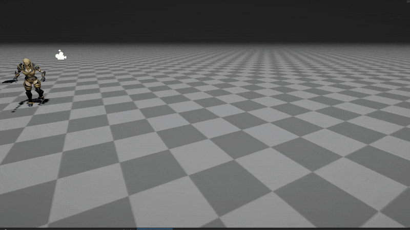
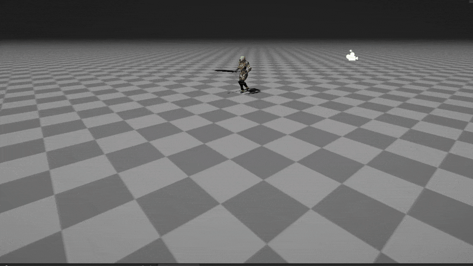

# CG-2025-1

## Computación Gráfica

### Integrantes

* Nicolás Hoyos
* Miguel Muñoz
* Sara Posada

### Entrega 3 "Shaders Personalizados"

#### Shader 1: Textura de Máscara Multicanal

1. Captura Árbol de nodos

2. GIF del Shader Funcionando

#### Shader 2: Máscara Radial

1. Captura Árbol de nodos

2. GIF del Shader Funcionando

#### Shader 3: Distorsión

1. Captura Árbol de nodos

2. GIF del Shader Funcionando

#### Shader 4: Movimiento de Humo

1. Captura Árbol de nodos

2. GIF del Shader Funcionando

#### Shader 5: Erosión

1. Captura Árbol de nodos

2. GIF del Shader Funcionando

#### Shader 6: Disolver Textura

1. Captura Árbol de nodos

2. GIF del Shader Funcionando

#### Shader 7: Coordenadas UV procedurales

1. Captura Árbol de nodos

2. GIF del Shader Funcionando

#### Shader 8: Textura en Espejo

1. Captura Árbol de nodos

2. GIF del Shader Funcionando

#### Shader 9: Matcap

1. Captura Árbol de nodos

2. GIF del Shader Funcionando

#### Shader 10: Intersección con ruido

1. Captura Árbol de nodos

2. GIF del Shader Funcionando

### Entrega 2 "Explosión"

### Entrega 1 "Slash"

#### Miguel Muñoz: 

#### Nicolás Hoyos:

