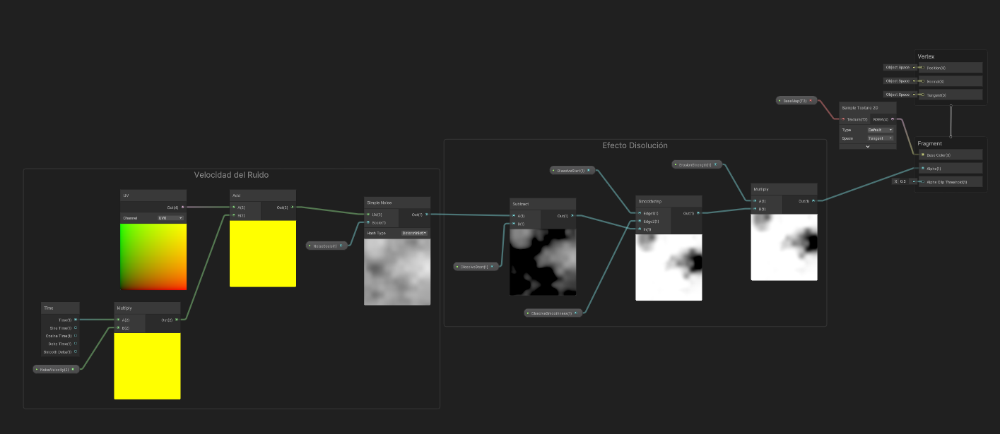

# CG-2025-1

## Computación Gráfica

### Integrantes

* Nicolás Hoyos
* Miguel Muñoz
* Sara Posada

## Entrega 3 "Shaders Personalizados"

### Shader 1: Textura de Máscara Multicanal

1. Captura Árbol de nodos

2. GIF del Shader Funcionando

### Shader 2: Máscara Radial

1. Captura Árbol de nodos

2. GIF del Shader Funcionando

### Shader 3: Distorsión

1. Captura Árbol de nodos

2. GIF del Shader Funcionando

### Shader 4: Movimiento de Humo

1. Captura Árbol de nodos


2. GIF del Shader Funcionando


### Shader 5: Erosión

1. Captura Árbol de nodos



2. GIF del Shader Funcionando


### Shader 6: Disolver Textura

1. Captura Árbol de nodos


2. GIF del Shader Funcionando


### Shader 7: Coordenadas UV procedurales

En este Shader hubo una particularidad: Se realizó un shader en HSLS por un error de concepto en la rúbrica. Si bien también hay árbol de nodos y la funcionalidad es la misma, 
se dejan ambas versiones como evidencia de trabajo. 

1. Captura Árbol de nodos


2. GIF del Shader Funcionando


3. Código en HSLS

```hlsl
Shader "Custom/PolarTextureShader"
{
    Properties
    {
        _MainTex ("Texture", 2D) = "white" {}
        _MainColor ("Main Color", Color) = (1,1,1,1)
        _TilingX ("Tiling R (rings)", Range(0,10)) = 1
        _TilingY ("Tiling Theta (twists)", Range(0,10)) = 1
    }
    SubShader
    {
        Tags { "RenderType"="Opaque" }
        LOD 100

        Pass
        {
            CGPROGRAM
            #pragma vertex vert
            #pragma fragment frag
            #include "UnityCG.cginc"

            sampler2D _MainTex;
            float4 _MainColor;
            float _TilingX;
            float _TilingY;

            struct appdata
            {
                float4 vertex : POSITION;
                float2 uv : TEXCOORD0;
            };

            struct v2f
            {
                float2 uv : TEXCOORD0;
                float4 vertex : SV_POSITION;
            };

            v2f vert (appdata v)
            {
                v2f o;
                o.vertex = UnityObjectToClipPos(v.vertex);
                o.uv = v.uv;
                return o;
            }

            fixed4 frag (v2f i) : SV_Target
            {
                float2 centeredUV = i.uv - 0.5;

                float r = length(centeredUV);
                float theta = atan2(centeredUV.y, centeredUV.x); // [-PI, PI]

                float normTheta = (theta + 3.14159265) / (2.0 * 3.14159265);

                // Aplica tiling en coordenadas polares
                float2 polarUV = float2(r * _TilingX, normTheta * _TilingY);

                // frac() para repetir entre 0 y 1
                fixed4 texColor = tex2D(_MainTex, frac(polarUV));

                return texColor * _MainColor;
            }
            ENDCG
        }
    }
}
```

4. GIF del Shader Funcionando


### Shader 8: Textura en Espejo

Para la textura en espejo también se realizaron dos versiones, pues la funcionalidad del árbol de nodos convencía del todo y hay una segunda versión con un CustomShader en HSLS

1. Captura Árbol de nodos


2. GIF del Shader Funcionando


3. Código en HSLS

```hlsl
Shader "Custom/MirrorTexture"
{
    Properties
    {
        _MainTex("Texture", 2D) = "white" {}
        _Tiling("Tiling", Range(0, 10)) = 1
    }
    SubShader
    {
        Tags { "RenderType"="Opaque" }
        LOD 100

        Pass
        {
            CGPROGRAM
            #pragma vertex vert
            #pragma fragment frag
            #include "UnityCG.cginc"

            sampler2D _MainTex;
            float _Tiling;

            struct appdata
            {
                float4 vertex : POSITION;
                float2 uv : TEXCOORD0;
            };

            struct v2f
            {
                float2 uv : TEXCOORD0;
                float4 vertex : SV_POSITION;
            };

            float mirror(float x)
            {
                // Onda triangular en [0,1]
                return 1.0 - abs(fmod(x * 0.5 - floor(x * 0.5 + 0.5), 1.0) * 2.0 - 1.0);
            }

            v2f vert(appdata v)
            {
                v2f o;
                o.vertex = UnityObjectToClipPos(v.vertex);
                o.uv = v.uv;
                return o;
            }

            fixed4 frag(v2f i) : SV_Target
            {
                float2 uv = (i.uv - 0.5) * _Tiling;
                uv = float2(mirror(uv.x), mirror(uv.y));
                return tex2D(_MainTex, uv);
            }
            ENDCG
        }
    }
}

```
4. GIF del Shader Funcionando


### Shader 9: Matcap

1. Captura Árbol de nodos


2. GIF del Shader Funcionando


### Shader 10: Intersección con ruido

1. Captura Árbol de nodos


2. GIF del Shader Funcionando


## Entrega 2 "Explosión"


### Entrega 1 "Slash"

#### Miguel Muñoz: 


#### Nicolás Hoyos:


